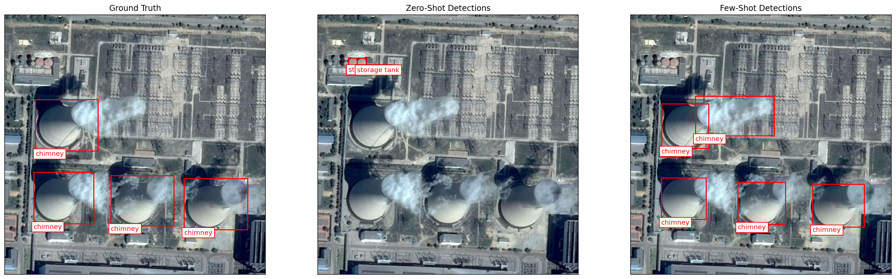
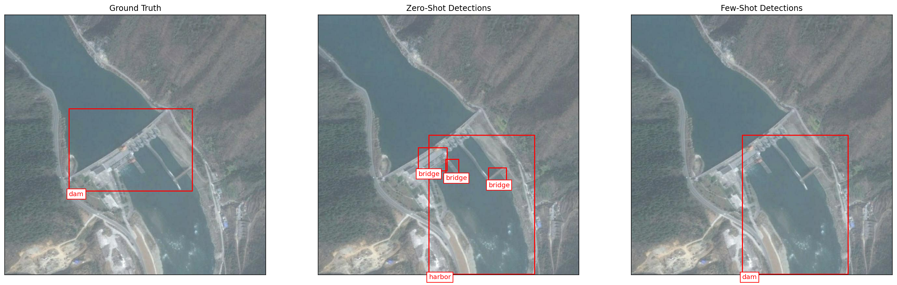

# Earth AI Remote Sensing Models

*This is not an officially supported Google product.*

## Installation

You can install the package from PyPI:

```bash
pip install remote-sensing
```

Alternatively, for development, you can install it in editable mode with
development dependencies:

```bash
pip install -e .[dev]
```

## Running tests

To run the tests, first install the package in development mode as described
above, then run `pytest`:

```bash
pytest
```

This is not an officially supported Google product. This project is not
eligible for the [Google Open Source Software Vulnerability Rewards
Program](https://bughunters.google.com/open-source-security).

## Few-shot Learning

### Introduction & Motivation

Open-vocabulary object detection (OVD) models offer flexibility but suffer from
semantic ambiguity, especially in specialized domains like Remote Sensing (RS).

**The Challenge:**

*   Zero-shot models struggle to distinguish fine-grained classes (e.g.,
    "fishing boat" vs. "yacht").
*   Acquiring dense labels in RS is labor-intensive and costly.
*   Full fine-tuning is computationally prohibitive for rapid deployment.

  DIOR
dataset results for 'chimney' (top) and 'dam' (bottom). Zero-shot detection
(center) produces noisy results with false positives. Our few-shot method
(right) refines the output, removing false positives and matching ground truth
(left).

The `remote_sensing.fewshot` package provides tools for few-shot classification,
allowing you to train a classifier with very few labeled examples. It uses an
active learning approach to interactively select the most informative examples
for labeling, and then trains a model based on these labels.

### Active Learning Workflow

The few-shot learning process is orchestrated by the `FewShotAlgorithm` class,
which follows these steps:

1.  **Example Selection**: The algorithm uses a sampling strategy to select a
    small number of examples from your unlabeled data that it determines would
    be most beneficial for training if they were labeled. The
    `get_indices_for_annotation` method returns the indices of these selected
    examples.
2.  **User Annotation**: You provide labels for the examples selected in the
    previous step.
3.  **Model Training**: The `train_few_shot_model` method takes the labeled
    examples and trains a `FewShotClassifier` model. This model can then be used
    for inference on new, unseen examples.

This loop can be repeated multiple times to iteratively improve the model's
performance.

### Sampling Strategies

The core of the active learning loop is the sampling strategy, which determines
which examples to select for annotation. The `remote_sensing.fewshot` package
provides several sampling strategies:

*   **`BaselineSampler`**: This sampler selects examples based on a combination
    of uncertainty and diversity. It prioritizes examples that the current model
    is uncertain about, and ensures diversity among the selected examples using
    a farthest-first traversal algorithm.
*   **`ClusteredMarginalEmbeddingsBasedSampler`**: This two-stage sampler first
    filters out high-scoring examples that are far from the decision boundary,
    and then uses K-Means clustering to select diverse and representative
    examples from the remaining candidates.
*   **`PCAKDEClusteringSampler`**: This sampler uses PCA to reduce the
    dimensionality of the embeddings, KDE to identify low-density regions
    (marginal candidates), and K-Means clustering to select a diverse subset of
    these candidates.

### Experimental Results

We evaluated on **DOTA** (Aerial) and **DIOR** (Optical RS) datasets using a
30-shot protocol.

**Few-shot detection performance (Average Precision)** *Our method significantly
outperforms zero-shot and few-shot baselines.*

Method                            | DOTA AP    | DIOR AP
:-------------------------------- | :--------- | :---------
Zero-shot OWLViT-v2 [1]           | 13.77%     | 14.98%
Zero-shot (RS-WebLI fine-tuned)   | 31.83%     | 29.39%
Jeune et al. [2]                  | 37.10%     | 35.60%
Prototype-based FSOD (DINOv2) [3] | 41.40%     | 26.46%
SIoU [4]                          | 45.88%     | 52.85%
**Ours (FLAME + RS-WebLI)**       | **53.96%** | **53.21%**

**Key Statistics:**

*   **Adaptation Latency:** ≈ **1 minute** per class on a standard CPU.
*   **DOTA Improvement:** **+22.1%** over Zero-shot RS-WebLI baseline.
*   **DIOR Improvement:** **+23.8%** over Zero-shot RS-WebLI baseline.

**References**

1.  **Minderer et al.** Scaling Open-Vocabulary Object Detection. NeurIPS 2024.
2.  **Jeune et al.** Improving few-shot object detection through a performance
    analysis on aerial and natural images. EUSIPCO 2022.
3.  **Bou et al.** Exploring robust features for few-shot object detection in
    satellite imagery. 2024.
4.  **Jeune et al.** SIoU Loss for Few-Shot Object Detection. 2023.

### Example Usage

For an example of how to use the `remote_sensing.fewshot` package, see the
[fewshot_demo_on_dior.ipynb](notebooks/fewshot_demo_on_dior.ipynb) notebook.

## Citation

The `remote_sensing.fewshot` package accompanies the paper: [On-the-Fly OVD
Adaptation with FLAME: Few-shot Localization via Active Marginal-Samples
Exploration](https://arxiv.org/abs/2510.17670).

If you use this code in your research, please cite:

```
@misc{refael2025ontheflyovdadaptationflame,
      title={On-the-Fly OVD Adaptation with FLAME: Few-shot Localization via Active Marginal-Samples Exploration},
      author={Yehonathan Refael and Amit Aides and Aviad Barzilai and George Leifman and Genady Beryozkin and Vered Silverman and Bolous Jaber and Tomer Shekel},
      year={2025},
      eprint={2510.17670},
      archivePrefix={arXiv},
      primaryClass={cs.LG},
      url={https://arxiv.org/abs/2510.17670},
}
```
